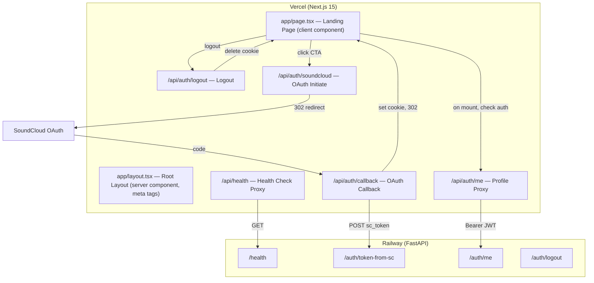

# Design Document: Launch-Ready MVP

## Overview

This design covers two workstreams needed before CybaOp's public launch:

1. **Landing page polish** — restructure `app/page.tsx` into clear sections (hero, how-it-works, features, comparison, trust signals, secondary CTA, footer) with SEO meta tags in `app/layout.tsx`, mobile-first responsive layout, OAuth loading state, and authenticated-user redirect.

2. **OAuth flow hardening** — remove the SoundCloud token fallback from `/api/auth/me`, add a frontend health-check proxy at `/api/health`, tighten error handling in the callback route, clean up the logout flow, and document all environment variables.

The frontend is Next.js 15 App Router on Vercel. The backend is FastAPI on Railway. Auth uses SoundCloud OAuth → backend `/auth/token-from-sc` → JWT → httpOnly cookie. The build uses `--no-lint`. All 77 existing backend tests must continue passing (no backend code changes are required by this spec).

## Architecture

The changes are entirely within the Next.js frontend layer. No backend modifications are needed.



### Key Design Decisions

1. **Landing page stays a client component** — it needs `useSearchParams` for error display, `useState` for loading state, and `useEffect` for the auth-redirect check. Keeping it as `"use client"` is the simplest path.

2. **SEO meta tags go in `app/layout.tsx`** — this is a server component, so Next.js `Metadata` export works natively. OG/Twitter tags are set here with the `metadata` export object.

3. **No backend changes** — the backend health endpoint, auth routes, and logout route already exist and work correctly. All changes are frontend-only, so the 77 backend tests are unaffected.

4. **Health check proxy uses `lib/fetch.ts`** — reuses the existing `backendFetch` wrapper with a 5-second timeout, consistent with the rest of the frontend proxy layer.

5. **SC token fallback removal is a strict deletion** — the `fetchFromSoundCloud` function and all references to it are removed from `app/api/auth/me/route.ts`. On 401 from backend, the route returns 401 and deletes the cookie. On backend unreachable, it returns 503.

## Components and Interfaces

### 1. Landing Page (`app/page.tsx`)

The page is restructured into distinct sections rendered by a single `HomeContent` component:

| Section | Description |
|---|---|
| **Hero** | Headline, subheadline, beta badge, primary CTA with loading state |
| **How It Works** | 3-step flow: Connect → Analyze → Act |
| **Feature Cards** | Track Analytics, Trend Detection, AI Insights, Triage, Workflows |
| **Comparison** | SoundCloud vs CybaOp side-by-side |
| **Trust Signals** | Read-only access, no third-party data storage, open analytics |
| **Secondary CTA** | Bottom-of-page "Connect SoundCloud" link |
| **Footer** | Copyright, tagline, Privacy Policy link, Terms of Service link |

**State:**
- `error: string | null` — from URL search params
- `isConnecting: boolean` — loading state for CTA button
- `isCheckingAuth: boolean` — true while calling `/api/auth/me` on mount

**Auth redirect flow (on mount):**
1. Call `fetch("/api/auth/me")`
2. If 200 → `router.push("/dashboard")`
3. If 401 or error → show landing page normally

**CTA click handler:**
1. Set `isConnecting = true`
2. `window.location.href = "/api/auth/soundcloud"`
3. Button shows "Connecting..." and is disabled

### 2. Root Layout (`app/layout.tsx`)

Expand the `metadata` export to include:

```typescript
export const metadata: Metadata = {
  title: "CybaOp — Intelligence Layer for SoundCloud Creators",
  description: "Analytics intelligence for SoundCloud creators. Engagement rates, trend detection, release timing, and AI-powered insights.",
  metadataBase: new URL("https://cyba-op.vercel.app"),
  alternates: { canonical: "/" },
  openGraph: {
    title: "CybaOp — Intelligence Layer for SoundCloud Creators",
    description: "Analytics intelligence for SoundCloud creators. Engagement rates, trend detection, release timing, and AI-powered insights.",
    url: "https://cyba-op.vercel.app",
    siteName: "CybaOp",
    type: "website",
    images: [{ url: "/og-image.png", width: 1200, height: 630, alt: "CybaOp" }],
  },
  twitter: {
    card: "summary_large_image",
    title: "CybaOp — Intelligence Layer for SoundCloud Creators",
    description: "Analytics intelligence for SoundCloud creators.",
    images: ["/og-image.png"],
  },
};
```

### 3. Me Route (`app/api/auth/me/route.ts`)

Simplified to JWT-only auth:

```
GET /api/auth/me
  → Read cybaop_token cookie
  → If missing → 401
  → backendFetch("/auth/me", Bearer token)
  → If 200 → return backend JSON
  → If 401 → 401 + delete cookie
  → If backend unreachable → 503 "Profile service unavailable"
```

The `fetchFromSoundCloud` helper function is deleted entirely.

### 4. Health Check Proxy (`app/api/health/route.ts`)

New route:

```
GET /api/health
  → backendFetch("/health", timeout 5000ms, retries 0)
  → If 200 → { status: "ok", backend: "reachable" }
  → If error/timeout → 503 { status: "degraded", backend: "unreachable" }
```

### 5. Logout Route (`app/api/auth/logout/route.ts`)

Already correctly implemented — deletes `cybaop_token` cookie and returns `{ success: true }`. No changes needed. The frontend `handleLogout` in `dashboard/page.tsx` already calls this and redirects to `/`.

### 6. Callback Route (`app/api/auth/callback/route.ts`)

Already correctly implemented with proper error handling for all cases. The one change: when the `code` param is missing, redirect to `/?error=exchange_failed` instead of returning a JSON 400 (so the user sees the landing page error UI, not a raw JSON response).

### 7. Environment Variable Documentation

Update `backend/.env.example` with all backend vars (including cache TTLs, guardrail thresholds). Create a new `.env.example` at the project root for frontend vars.


## Data Models

No new data models are introduced. The existing types are sufficient:

### Frontend Types (unchanged)

```typescript
// Error codes displayed on landing page (already exists in app/page.tsx)
type ErrorCode = "auth_failed" | "timeout" | "service_unavailable" | "exchange_failed" | "unexpected";

// User profile shape returned by /api/auth/me (already exists in dashboard/page.tsx)
interface UserData {
  username?: string;
  display_name?: string;
  user_id?: string;
  tier?: string;
  followers_count?: number;
  following_count?: number;
  track_count?: number;
  playlist_count?: number;
  likes_count?: number;
  avatar_url?: string;
  profile_url?: string;
}
```

### Health Check Response (new)

```typescript
// GET /api/health response
interface HealthResponse {
  status: "ok" | "degraded";
  backend: "reachable" | "unreachable";
}
```

### Environment Variables

**Frontend (Vercel):**

| Variable | Required | Example | Description |
|---|---|---|---|
| `SOUNDCLOUD_CLIENT_ID` | Yes | `your-client-id` | SoundCloud OAuth app client ID |
| `SOUNDCLOUD_CLIENT_SECRET` | Yes | `your-client-secret` | SoundCloud OAuth app client secret |
| `SOUNDCLOUD_REDIRECT_URI` | Yes | `https://cyba-op.vercel.app/api/auth/callback` | OAuth callback URL |
| `BACKEND_URL` | Yes | `https://delightful-beauty-production-7537.up.railway.app` | FastAPI backend URL |
| `LOG_LEVEL` | No | `debug` | Enables debug logging in callback route |

**Backend (Railway):**

| Variable | Required | Example | Description |
|---|---|---|---|
| `SOUNDCLOUD_CLIENT_ID` | Yes | `your-client-id` | SoundCloud OAuth app client ID |
| `SOUNDCLOUD_CLIENT_SECRET` | Yes | `your-client-secret` | SoundCloud OAuth app client secret |
| `SOUNDCLOUD_REDIRECT_URI` | No | `https://cyba-op.vercel.app/api/auth/callback` | OAuth callback URL (used by `/auth/token` route) |
| `DATABASE_URL` | Yes | `postgresql://...` | Neon Postgres connection string |
| `JWT_SECRET` | Yes | `random-secret` | Secret for signing JWTs |
| `JWT_ALGORITHM` | No | `HS256` | JWT signing algorithm (default: HS256) |
| `JWT_EXPIRY_HOURS` | No | `720` | JWT lifetime in hours (default: 720 / 30 days) |
| `GOOGLE_API_KEY` | No | `AIza...` | Gemini API key for AI insights |
| `API_PORT` | No | `8000` | Server port (default: 8000) |
| `API_HOST` | No | `0.0.0.0` | Server bind address |
| `FRONTEND_URL` | Yes | `https://cyba-op.vercel.app` | Frontend URL for CORS |
| `ENV` | No | `production` | Environment name (default: development) |
| `LOG_LEVEL` | No | `info` | Log level (default: debug) |
| `RATE_LIMIT_PER_MINUTE` | No | `30` | API rate limit per IP |
| `CACHE_TTL_PROFILE` | No | `3600` | Profile cache TTL in seconds |
| `CACHE_TTL_TRACKS` | No | `1800` | Tracks cache TTL in seconds |
| `CACHE_TTL_INSIGHTS` | No | `21600` | Insights cache TTL in seconds |


## Correctness Properties

*A property is a characteristic or behavior that should hold true across all valid executions of a system — essentially, a formal statement about what the system should do. Properties serve as the bridge between human-readable specifications and machine-verifiable correctness guarantees.*

### Property 1: Me route uses only JWT backend auth

*For any* request to `/api/auth/me` with a `cybaop_token` cookie, the route shall forward the token to the backend `/auth/me` endpoint as a Bearer token and shall never make any request to `api.soundcloud.com`. The response shall be derived solely from the backend's response.

**Validates: Requirements 7.1, 7.2**

### Property 2: Me route clears cookie on backend 401

*For any* request to `/api/auth/me` where the backend returns a 401 status, the route shall return a 401 response to the client and the response shall include a `Set-Cookie` header that deletes the `cybaop_token` cookie.

**Validates: Requirements 7.3**

### Property 3: Me route returns 503 when backend is unreachable

*For any* request to `/api/auth/me` where the backend is unreachable (network error, timeout, DNS failure), the route shall return a 503 response with the body `{ "error": "Profile service unavailable" }`.

**Validates: Requirements 7.4**

### Property 4: Health check reflects backend reachability

*For any* GET request to `/api/health`, if the backend `/health` endpoint responds successfully, the route shall return 200 with `{ "status": "ok", "backend": "reachable" }`. If the backend is unreachable or errors, the route shall return 503 with `{ "status": "degraded", "backend": "unreachable" }`.

**Validates: Requirements 8.2, 8.3**

### Property 5: Callback route maps failure modes to correct error redirects

*For any* OAuth callback request, if the SoundCloud token exchange times out, the redirect shall use `error=timeout`. If the SoundCloud exchange returns a non-200 response, the redirect shall use `error=auth_failed`. If the backend is unreachable during registration, the redirect shall use `error=service_unavailable`. The redirect target shall always be the landing page.

**Validates: Requirements 9.1, 9.2, 9.4**

### Property 6: Authenticated users are redirected from landing page

*For any* visit to the landing page where `/api/auth/me` returns a 200 response, the page shall redirect the user to `/dashboard`.

**Validates: Requirements 11.1**

### Property 7: Logout deletes session cookie

*For any* POST request to `/api/auth/logout`, the response shall include a `Set-Cookie` header that deletes the `cybaop_token` cookie.

**Validates: Requirements 12.2**

## Error Handling

### Landing Page Errors

| Error Code | Message | Trigger |
|---|---|---|
| `auth_failed` | "Authentication failed — please try again." | SoundCloud rejects the OAuth code |
| `timeout` | "The server took too long to respond." | SoundCloud exchange times out |
| `service_unavailable` | "Authentication service is temporarily unavailable." | Backend unreachable during registration |
| `exchange_failed` | "Something went wrong during sign-in." | Missing authorization code in callback |
| `unexpected` | "An unexpected error occurred." | Unhandled exception in callback |

Each error message is displayed in a styled alert box with a "Try again" link pointing to `/api/auth/soundcloud`.

### API Route Error Responses

| Route | Condition | Status | Body |
|---|---|---|---|
| `/api/auth/me` | No cookie | 401 | `{ "error": "Not authenticated" }` |
| `/api/auth/me` | Backend 401 | 401 | `{ "error": "Session expired" }` + delete cookie |
| `/api/auth/me` | Backend unreachable | 503 | `{ "error": "Profile service unavailable" }` |
| `/api/auth/me` | Backend 5xx | 502 | `{ "error": "Failed to fetch profile" }` |
| `/api/health` | Backend reachable | 200 | `{ "status": "ok", "backend": "reachable" }` |
| `/api/health` | Backend unreachable | 503 | `{ "status": "degraded", "backend": "unreachable" }` |
| `/api/auth/logout` | Any | 200 | `{ "success": true }` + delete cookie |
| `/api/auth/callback` | Missing code | 302 | Redirect to `/?error=exchange_failed` |

## Testing Strategy

### Property-Based Tests

Property-based tests use `fast-check` (the standard PBT library for TypeScript/JavaScript). Each property test runs a minimum of 100 iterations with randomly generated inputs.

Each test is tagged with a comment referencing the design property:
```
// Feature: launch-ready-mvp, Property {N}: {property_text}
```

| Property | Test Approach |
|---|---|
| P1: Me route JWT-only | Generate random token strings, mock `backendFetch`, assert no calls to `api.soundcloud.com` |
| P2: Me route 401 cookie clear | Generate random tokens, mock backend returning 401, assert response is 401 with cookie deletion header |
| P3: Me route 503 on unreachable | Generate random tokens, mock backend throwing network errors, assert 503 response |
| P4: Health check reachability | Generate random backend responses (200, 500, timeout), assert correct status/body mapping |
| P5: Callback error mapping | Generate random failure scenarios (SC timeout, SC error, backend unreachable), assert correct error code in redirect URL |
| P6: Auth redirect | Mock `/api/auth/me` returning 200 with random user data, assert redirect to `/dashboard` |
| P7: Logout cookie deletion | Assert POST to `/api/auth/logout` always returns response with cookie deletion |

### Unit Tests (Examples and Edge Cases)

Unit tests cover specific examples, edge cases, and content verification:

- **Landing page content**: Verify presence of required sections (hero, how-it-works, features, comparison, trust signals, footer)
- **SEO metadata**: Verify `layout.tsx` metadata export contains all required OG and Twitter tags
- **Error messages**: Verify all 5 error codes map to non-empty human-readable messages with "Try again" links
- **Missing code callback**: Verify callback redirects to `/?error=exchange_failed` when code param is absent
- **Loading state**: Verify CTA button shows "Connecting..." and is disabled when clicked
- **Env documentation**: Verify `.env.example` files contain all required variable names
- **Logout route**: Verify POST returns `{ success: true }` and deletes cookie

### Test Configuration

- PBT library: `fast-check` (npm package)
- Test runner: The project doesn't currently have a frontend test runner. Tests should use `vitest` with `--run` flag for single execution.
- Minimum iterations per property: 100
- Backend tests: No changes — all 77 existing pytest tests continue to pass since no backend code is modified.
