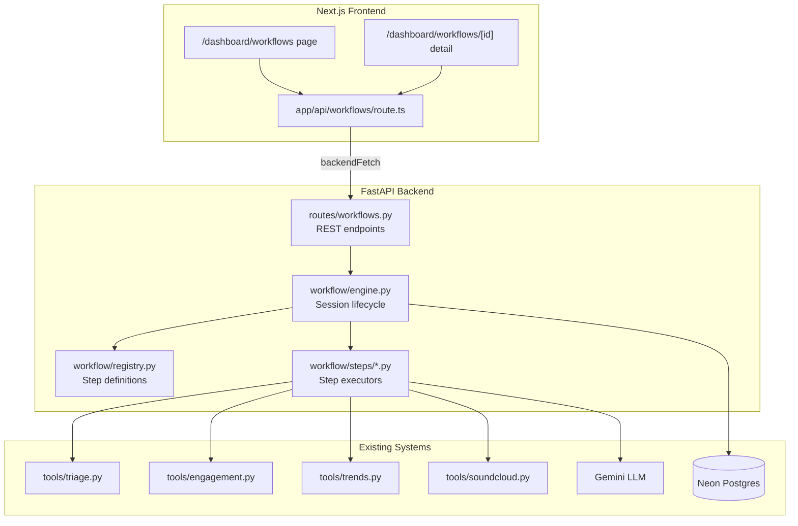

# Design Document: Stateful Creator Workflows

## Overview

Stateful Creator Workflows extends CybaOp with persistent, multi-step workflow pipelines that transform one-shot analytics into guided operational sessions. Three workflow types — Portfolio Critique, Remediation Pipeline, and Release Planner — each follow a defined step sequence managed by a central Workflow Engine. A composite Health Score (0–100) provides a single-number portfolio assessment that evolves over time.

The system integrates with the existing LangGraph analytics pipeline, triage engine, and Gemini LLM. All workflow state persists in Postgres via the existing asyncpg pool. The frontend adds an ops-style Workflows tab with monospace typography, structured panels, and step-sequence progress indicators.

Key design decisions:
- **No new ORM** — raw SQL via asyncpg, consistent with existing `src/db/queries.py` patterns
- **JSONB for step context** — flexible schema for heterogeneous workflow state without table-per-workflow-type
- **Workflow Registry as code** — step sequences defined in Python dicts, not database rows, for type safety and testability
- **Optimistic locking** — `updated_at` column prevents concurrent step execution on the same session
- **Reuse existing infrastructure** — triage engine, engagement metrics, trend analysis, and Gemini integration are called from workflow steps, not duplicated

## Architecture



The Workflow Engine sits between the API routes and the step executors. It handles session lifecycle (create, advance, pause, resume), enforces step ordering from the Registry, persists state to Postgres, and delegates actual computation to step executor functions that call into existing tools.

### Request Flow

1. Frontend calls `POST /workflows` to create a session
2. Engine creates a `workflow_sessions` row with status `active`, sets `current_step` to the first step
3. Frontend calls `POST /workflows/{id}/advance` with user input
4. Engine validates the session is active and not locked, loads context from DB
5. Engine looks up the current step executor from the Registry, runs it
6. Step executor calls existing tools (triage, engagement, Gemini, etc.), returns output
7. Engine persists step result to `workflow_steps`, updates session context and `current_step`
8. If final step, engine marks session `completed`
9. Frontend polls `GET /workflows/{id}` to render updated state

## Components and Interfaces

### Workflow Registry (`src/workflow/registry.py`)

Defines available workflow types and their step sequences as static configuration.

```python
from dataclasses import dataclass

@dataclass(frozen=True)
class StepDefinition:
    name: str                    # e.g. "fetch_tracks", "critique_track"
    label: str                   # Human-readable: "Fetching catalog"
    requires_input: bool = False # Whether advance needs user input
    skippable: bool = False      # Whether the creator can skip this step

WORKFLOW_TYPES: dict[str, list[StepDefinition]] = {
    "portfolio_critique": [
        StepDefinition("fetch_tracks", "Fetching catalog"),
        StepDefinition("critique_track", "Analyzing track", requires_input=False, skippable=True),
        # critique_track repeats per track — engine handles iteration via context
        StepDefinition("portfolio_summary", "Generating portfolio summary"),
    ],
    "remediation": [
        StepDefinition("load_incident", "Loading incident context"),
        StepDefinition("remediation_step", "Remediation action", requires_input=True, skippable=True),
        # remediation_step repeats per action — engine handles iteration
        StepDefinition("verify_outcome", "Verifying improvement"),
    ],
    "release_planner": [
        StepDefinition("load_context", "Loading historical data"),
        StepDefinition("timing_recommendation", "Analyzing release timing", requires_input=True),
        StepDefinition("style_recommendation", "Analyzing genre & style", requires_input=True),
        StepDefinition("promotion_strategy", "Building promotion plan", requires_input=True),
        StepDefinition("compile_plan", "Compiling release plan"),
    ],
}

def get_workflow_steps(workflow_type: str) -> list[StepDefinition]:
    steps = WORKFLOW_TYPES.get(workflow_type)
    if not steps:
        raise ValueError(f"Unknown workflow type: {workflow_type}")
    return steps

def get_step_definition(workflow_type: str, step_name: str) -> StepDefinition:
    for step in get_workflow_steps(workflow_type):
        if step.name == step_name:
            return step
    raise ValueError(f"Unknown step {step_name} for {workflow_type}")
```

### Workflow Engine (`src/workflow/engine.py`)

Core session lifecycle manager. All methods are async and use the existing asyncpg pool.

```python
class WorkflowEngine:
    async def create_session(
        self, user_id: str, workflow_type: str, params: dict | None = None
    ) -> WorkflowSession:
        """Create a new session. Returns the session with first step set."""

    async def get_session(self, session_id: str, user_id: str) -> WorkflowSession:
        """Load session state from DB. Raises NotFoundError if missing."""

    async def advance_session(
        self, session_id: str, user_id: str, user_input: dict | None = None
    ) -> WorkflowSession:
        """Execute current step and advance to next. Raises ConcurrencyError if locked."""

    async def skip_step(self, session_id: str, user_id: str) -> WorkflowSession:
        """Skip current step if skippable. Raises ValidationError if not."""

    async def pause_session(self, session_id: str, user_id: str) -> WorkflowSession:
        """Pause an active session."""

    async def resume_session(self, session_id: str, user_id: str) -> WorkflowSession:
        """Resume a paused session."""

    async def list_sessions(
        self, user_id: str, status: str | None = None
    ) -> list[WorkflowSession]:
        """List sessions for a user, optionally filtered by status."""
```

Concurrency control: `advance_session` uses `UPDATE ... WHERE updated_at = $expected` to prevent concurrent execution. If the row wasn't updated (another request got there first), it raises `ConcurrencyError`.

### Step Executors (`src/workflow/steps/`)

Each step executor is an async function with signature:

```python
async def execute(context: dict, user_input: dict | None = None) -> StepResult:
    """Run the step logic. Returns output to merge into context."""
```

Step executors are organized by workflow type:

- `src/workflow/steps/critique.py` — `fetch_tracks_step`, `critique_track_step`, `portfolio_summary_step`
- `src/workflow/steps/remediation.py` — `load_incident_step`, `remediation_step`, `verify_outcome_step`
- `src/workflow/steps/planner.py` — `load_context_step`, `timing_step`, `style_step`, `promotion_step`, `compile_plan_step`

### Health Score Calculator (`src/workflow/health.py`)

Pure computation function, no I/O:

```python
@dataclass
class HealthScoreResult:
    score: int                          # 0-100
    components: dict[str, float | None] # component name → normalized 0-1 value (None if missing)
    missing_components: list[str]
    explanation: str | None = None      # AI-generated if score changed significantly

def compute_health_score(
    metrics: AnalyticsMetrics | None,
    trends: TrendAnalysis | None,
    triage_report: TriageReport | None,
    tracks: list[TrackData] | None,
) -> HealthScoreResult:
    """Compute composite health score from available data."""
```

### API Routes (`src/api/routes/workflows.py`)

```python
router = APIRouter(prefix="/workflows", tags=["workflows"])

@router.post("", response_model=WorkflowSessionResponse)
async def create_workflow(body: CreateWorkflowRequest, user: dict = Depends(require_pro)):
    ...

@router.get("/{session_id}", response_model=WorkflowSessionResponse)
async def get_workflow(session_id: str, user: dict = Depends(require_pro)):
    ...

@router.post("/{session_id}/advance", response_model=WorkflowSessionResponse)
async def advance_workflow(session_id: str, body: AdvanceRequest, user: dict = Depends(require_pro)):
    ...

@router.post("/{session_id}/skip", response_model=WorkflowSessionResponse)
async def skip_step(session_id: str, user: dict = Depends(require_pro)):
    ...

@router.post("/{session_id}/pause", response_model=WorkflowSessionResponse)
async def pause_workflow(session_id: str, user: dict = Depends(require_pro)):
    ...

@router.post("/{session_id}/resume", response_model=WorkflowSessionResponse)
async def resume_workflow(session_id: str, user: dict = Depends(require_pro)):
    ...

@router.get("", response_model=WorkflowListResponse)
async def list_workflows(status: str | None = None, user: dict = Depends(require_pro)):
    ...

@router.get("/health-score/history", response_model=HealthScoreHistoryResponse)
async def health_score_history(user: dict = Depends(require_pro)):
    ...
```

`require_pro` is a dependency that wraps `get_current_user` and checks `tier in ("pro", "enterprise")`, returning 403 otherwise.

### Pydantic Models (`src/shared/models.py` additions)

```python
class WorkflowStatus(str, Enum):
    ACTIVE = "active"
    PAUSED = "paused"
    COMPLETED = "completed"
    FAILED = "failed"

class StepStatus(str, Enum):
    PENDING = "pending"
    ACTIVE = "active"
    COMPLETED = "completed"
    FAILED = "failed"
    SKIPPED = "skipped"

class RemediationOutcome(str, Enum):
    RESOLVED = "resolved"
    PARTIALLY_RESOLVED = "partially_resolved"
    UNRESOLVED = "unresolved"

class CreateWorkflowRequest(BaseModel):
    workflow_type: str  # "portfolio_critique" | "remediation" | "release_planner"
    params: dict = {}   # e.g. {"incident_id": "..."} for remediation

class AdvanceRequest(BaseModel):
    user_input: dict = {}

class WorkflowStepResponse(BaseModel):
    step_name: str
    label: str
    status: StepStatus
    output: dict | None = None
    skippable: bool = False
    started_at: datetime | None = None
    completed_at: datetime | None = None

class WorkflowSessionResponse(BaseModel):
    id: str
    workflow_type: str
    status: WorkflowStatus
    current_step: str | None
    steps: list[WorkflowStepResponse]
    context: dict  # accumulated step context (filtered for frontend)
    health_score: int | None = None
    created_at: datetime
    updated_at: datetime
    completed_at: datetime | None = None

class WorkflowListResponse(BaseModel):
    sessions: list[WorkflowSessionResponse]
    total: int

class HealthScorePoint(BaseModel):
    score: int
    components: dict
    computed_at: datetime
    explanation: str | None = None

class HealthScoreHistoryResponse(BaseModel):
    history: list[HealthScorePoint]
    current_score: int | None = None
```

### Frontend Components

```
app/dashboard/workflows/
├── page.tsx                    # Workflow list + health score overview
└── [id]/
    └── page.tsx                # Single workflow detail view

app/dashboard/components/
├── workflow-step-list.tsx      # Vertical step sequence with status dots
├── health-score-display.tsx    # Score readout + sparkline
├── critique-panel.tsx          # Structured AI critique output
└── remediation-checklist.tsx   # Checklist with before/after metrics
```

The workflows list page shows active/completed sessions and the health score prominently. The detail page renders the step sequence vertically with the current step expanded, using monospace fonts and the existing color palette (lime/amber/rose/sky for status).

### Navigation Integration

Add a "Workflows" tab to the existing `tabs` array in `app/dashboard/components/nav.tsx`:

```typescript
{ href: "/dashboard/workflows", label: "Workflows", icon: "⚙️" },
```

### Next.js API Proxy

```
app/api/workflows/
├── route.ts                    # GET list, POST create
└── [id]/
    ├── route.ts                # GET session
    ├── advance/route.ts        # POST advance
    ├── skip/route.ts           # POST skip
    ├── pause/route.ts          # POST pause
    └── resume/route.ts         # POST resume

app/api/health-score/
└── route.ts                    # GET history
```

All proxy routes follow the existing pattern: read `cybaop_token` cookie, forward to backend via `backendFetch`.

## Data Models

### Database Schema

Four new tables added to `src/db/schema.py`:

```sql
CREATE TABLE IF NOT EXISTS workflow_sessions (
    id UUID PRIMARY KEY DEFAULT gen_random_uuid(),
    user_id TEXT NOT NULL REFERENCES users(id),
    workflow_type TEXT NOT NULL,
    status TEXT NOT NULL DEFAULT 'active',
    current_step TEXT,
    context JSONB NOT NULL DEFAULT '{}',
    created_at TIMESTAMPTZ NOT NULL DEFAULT NOW(),
    updated_at TIMESTAMPTZ NOT NULL DEFAULT NOW(),
    completed_at TIMESTAMPTZ
);

CREATE INDEX IF NOT EXISTS idx_wf_sessions_user_status
    ON workflow_sessions(user_id, status);

CREATE INDEX IF NOT EXISTS idx_wf_sessions_user_created
    ON workflow_sessions(user_id, created_at DESC);

CREATE TABLE IF NOT EXISTS workflow_steps (
    id UUID PRIMARY KEY DEFAULT gen_random_uuid(),
    session_id UUID NOT NULL REFERENCES workflow_sessions(id) ON DELETE CASCADE,
    step_name TEXT NOT NULL,
    status TEXT NOT NULL DEFAULT 'pending',
    input JSONB NOT NULL DEFAULT '{}',
    output JSONB NOT NULL DEFAULT '{}',
    started_at TIMESTAMPTZ,
    completed_at TIMESTAMPTZ
);

CREATE INDEX IF NOT EXISTS idx_wf_steps_session
    ON workflow_steps(session_id, step_name);

CREATE TABLE IF NOT EXISTS health_scores (
    id UUID PRIMARY KEY DEFAULT gen_random_uuid(),
    user_id TEXT NOT NULL REFERENCES users(id),
    score INTEGER NOT NULL CHECK (score >= 0 AND score <= 100),
    components JSONB NOT NULL DEFAULT '{}',
    explanation TEXT,
    computed_at TIMESTAMPTZ NOT NULL DEFAULT NOW()
);

CREATE INDEX IF NOT EXISTS idx_health_scores_user_time
    ON health_scores(user_id, computed_at DESC);

CREATE TABLE IF NOT EXISTS remediation_outcomes (
    id UUID PRIMARY KEY DEFAULT gen_random_uuid(),
    session_id UUID NOT NULL REFERENCES workflow_sessions(id) ON DELETE CASCADE,
    incident_type TEXT NOT NULL,
    original_severity TEXT NOT NULL,
    outcome TEXT NOT NULL DEFAULT 'unresolved',
    resolved_at TIMESTAMPTZ
);

CREATE INDEX IF NOT EXISTS idx_remediation_session
    ON remediation_outcomes(session_id);
```

### JSONB Context Structure

The `workflow_sessions.context` JSONB column carries different shapes per workflow type:

**portfolio_critique context:**
```json
{
  "track_ids": ["id1", "id2", ...],
  "current_track_index": 2,
  "critiques": {
    "id1": { "strength": "...", "weakness": "...", "diagnosis": "...", "recommendation": "..." },
    "id2": { ... }
  },
  "skipped_tracks": ["id3"],
  "portfolio_summary": null
}
```

**remediation context:**
```json
{
  "incident_type": "play_decay",
  "incident_severity": "critical",
  "affected_track_id": "abc123",
  "affected_track_title": "My Track",
  "metric_value": 0.52,
  "threshold": 0.3,
  "remediation_steps": [
    { "action": "Repost the track", "expected_impact": "Re-surfaces in follower feeds", "status": "completed" },
    { "action": "Update tags and description", "expected_impact": "Improves discoverability", "status": "pending" }
  ],
  "current_step_index": 1,
  "pre_metrics": { "play_count": 500, "engagement_rate": 0.02 },
  "post_metrics": null,
  "outcome": null
}
```

**release_planner context:**
```json
{
  "best_release_day": "Thursday",
  "best_release_hour": 14,
  "era_fingerprint": { ... },
  "catalog_concentration": 0.65,
  "growth_velocity_7d": 0.12,
  "timing_recommendation": { "day": "Thursday", "hour": 14, "rationale": "..." },
  "timing_override": null,
  "style_recommendation": { "genre": "Lo-fi", "rationale": "..." },
  "style_override": null,
  "promotion_strategy": { "actions": [...], "rationale": "..." },
  "promotion_override": null,
  "release_plan": null
}
```

### Health Score Computation Algorithm

The Health Score is a weighted composite of 5 normalized components:

| Component | Weight | Source | Normalization |
|---|---|---|---|
| Engagement Rate | 25% | `AnalyticsMetrics.avg_engagement_rate` | `min(rate / 0.10, 1.0)` — 10% engagement = perfect score |
| Catalog Diversity | 20% | `1 - AnalyticsMetrics.catalog_concentration` | Direct (0 = all plays on one track, 1 = even spread) |
| Release Cadence | 20% | Days since last release | `max(0, 1 - days_since / 90)` — 0 days = 1.0, 90+ days = 0.0 |
| Trend Momentum | 20% | `TrendAnalysis.growth_velocity_30d` | `min(max(velocity + 0.5, 0) / 1.0, 1.0)` — maps [-0.5, 0.5] to [0, 1] |
| Incident Severity | 15% | `TriageReport` | `1 - (critical * 0.3 + warning * 0.1)` clamped to [0, 1] |

Final score: `round(sum(component * weight for available components) / sum(weight for available components) * 100)`

When a component's source data is unavailable, it's excluded from both numerator and denominator, producing a partial score. The `missing_components` list indicates which were omitted.

### Workflow Step Sequences

**Portfolio Critique:**
1. `fetch_tracks` — Calls `soundcloud.fetch_tracks()`, stores track list in context, sets `current_track_index = 0`
2. `critique_track` (repeating) — Sends current track + catalog metrics to Gemini, stores structured critique. Engine increments `current_track_index`. Repeats until all tracks processed or skipped.
3. `portfolio_summary` — Sends all critiques to Gemini for cross-catalog pattern analysis

**Remediation Pipeline:**
1. `load_incident` — Loads incident from triage context, generates remediation step list based on `incident_type`
2. `remediation_step` (repeating) — Presents current action, accepts completed/skipped from user. Increments `current_step_index`.
3. `verify_outcome` — Re-runs `run_triage()` on current data, compares to pre-metrics, persists outcome to `remediation_outcomes`

**Release Planner:**
1. `load_context` — Loads trends, era fingerprint, catalog metrics from existing analytics
2. `timing_recommendation` — Gemini analyzes release timing data, user can override
3. `style_recommendation` — Gemini analyzes genre/style gaps, user can override
4. `promotion_strategy` — Gemini builds promotion plan from growth data, user can override
5. `compile_plan` — Assembles all recommendations (with overrides) into final release plan document

### Repeating Step Mechanism

For `critique_track` and `remediation_step`, the engine checks context to determine if the step should repeat:

```python
def _should_repeat_step(workflow_type: str, step_name: str, context: dict) -> bool:
    if workflow_type == "portfolio_critique" and step_name == "critique_track":
        return context.get("current_track_index", 0) < len(context.get("track_ids", []))
    if workflow_type == "remediation" and step_name == "remediation_step":
        return context.get("current_step_index", 0) < len(context.get("remediation_steps", []))
    return False
```

When a repeating step completes and `_should_repeat_step` returns True, the engine does not advance `current_step` to the next step definition — it stays on the same step but with updated context (incremented index).


## Correctness Properties

*A property is a characteristic or behavior that should hold true across all valid executions of a system — essentially, a formal statement about what the system should do. Properties serve as the bridge between human-readable specifications and machine-verifiable correctness guarantees.*

### Property 1: Session lifecycle produces unique IDs and valid state transitions

*For any* valid workflow type and user ID, creating a workflow session should produce a session with a unique UUID that differs from all other session IDs, with status "active" and current_step set to the first step in the registry. Furthermore, the session should only transition through valid states: active → paused, active → completed, active → failed, paused → active, and no other transitions.

**Validates: Requirements 1.1, 1.2**

### Property 2: Pause/resume round-trip preserves context

*For any* workflow session that has been advanced through one or more steps (accumulating context), pausing and then resuming the session should return a session whose context is identical to the context at the time of pausing.

**Validates: Requirements 1.4**

### Property 3: Step failure preserves prior valid state

*For any* workflow session where the current step executor raises an error, the session context should remain identical to the context before the failed step was attempted, the current_step should not advance, and the step should be marked as "failed" while the session remains "active".

**Validates: Requirements 1.5**

### Property 4: Step ordering maintained including skips

*For any* workflow session and any sequence of advance/skip operations, the ordered list of completed and skipped step names should be a valid prefix of the step sequence defined in the Workflow Registry for that workflow type. No step should appear out of order, and no step should be missing between two completed steps (except skipped steps which are explicitly allowed).

**Validates: Requirements 1.6, 2.5**

### Property 5: Critique step produces structured output with required fields

*For any* track with valid metadata (non-empty title, non-negative play_count), when processed by the critique_track step, the output should contain all four required fields: "strength" (non-empty string), "weakness" (non-empty string), "diagnosis" (non-empty string), and "recommendation" (non-empty string). The input to the step should contain the track's metadata, engagement rate, and catalog-relative performance score.

**Validates: Requirements 2.2, 2.3**

### Property 6: Remediation launch gating by severity

*For any* triage incident, creating a remediation workflow should succeed if and only if the incident severity is "critical" or "warning". Incidents with severity "info" or "healthy" should be rejected with a validation error.

**Validates: Requirements 3.1**

### Property 7: Incident context initialization and type-specific remediation steps

*For any* incident with severity "critical" or "warning", when a remediation workflow is created from that incident, the initial context should contain the incident_type, incident_severity, affected_track_id, metric_value, and threshold. The generated remediation steps should each contain a non-empty "action" string and a non-empty "expected_impact" string. Different incident types (play_decay, engagement_drop, stale_catalog, concentration_risk, underperformer, silent_track) should produce different remediation step lists.

**Validates: Requirements 3.2, 3.3, 3.4**

### Property 8: Remediation outcome is valid and linked

*For any* completed remediation workflow, the persisted outcome should be exactly one of "resolved", "partially_resolved", or "unresolved", and the remediation_outcomes row should reference the correct session_id and incident_type.

**Validates: Requirements 3.6**

### Property 9: Release planner context contains required historical data

*For any* release planner workflow after the load_context step completes, the session context should contain: best_release_day (string or null), best_release_hour (int or null), era_fingerprint (dict or null), catalog_concentration (float), and growth_velocity_7d (float). All numeric values should be within their valid ranges.

**Validates: Requirements 4.1**

### Property 10: Completed release plan contains all sections

*For any* completed release planner workflow, the final release plan in the context should contain three non-null sections: timing_recommendation, style_recommendation, and promotion_strategy. Each section should contain a "rationale" field.

**Validates: Requirements 4.5**

### Property 11: User overrides propagate to subsequent steps

*For any* release planner step where the user provides an override via user_input, the next step's context should contain the override value under the corresponding override key (e.g., timing_override, style_override, promotion_override), and the override should take precedence over the AI recommendation when referenced by subsequent step executors.

**Validates: Requirements 4.6**

### Property 12: Health score range and correct weighting

*For any* valid combination of component inputs (engagement_rate ≥ 0, catalog_concentration in [0,1], days_since_release ≥ 0, growth_velocity as any float, critical_count ≥ 0, warning_count ≥ 0), the computed health score should be an integer in [0, 100]. When all components are available, the score should equal the weighted sum using the defined weights (25%, 20%, 20%, 20%, 15%) after normalization, rounded to the nearest integer.

**Validates: Requirements 5.1**

### Property 13: Significant health score change detection

*For any* two consecutive health score computations for the same user where the absolute difference exceeds 10 points, the system should flag the change as significant. When the difference is 10 or less, it should not be flagged.

**Validates: Requirements 5.4**

### Property 14: Partial health score with missing components

*For any* subset of the 5 health score components where at least one component is available and at least one is missing, the computed score should use only the available components (re-normalizing weights to sum to 1.0), and the missing_components list should contain exactly the names of the unavailable components. The score should still be in [0, 100].

**Validates: Requirements 5.5**

### Property 15: Session list filtering by status

*For any* user with multiple workflow sessions in different statuses (active, paused, completed), filtering by a specific status should return only sessions with that exact status. The count of filtered results should equal the count of sessions with that status in the full list.

**Validates: Requirements 6.4**

### Property 16: Pro tier gating returns 403 for non-Pro users

*For any* workflow API endpoint and any user with tier "free", the endpoint should return HTTP 403 with an error message containing "Pro". Users with tier "pro" or "enterprise" should not receive 403.

**Validates: Requirements 6.6, 6.7**

## Error Handling

### Backend Error Hierarchy

New exceptions added to `src/shared/errors.py`:

```python
class WorkflowError(CybaOpError):
    """Base for workflow-specific errors."""
    def __init__(self, message: str, error_code: str = "WORKFLOW_ERROR"):
        super().__init__(message, error_code)

class WorkflowNotFoundError(WorkflowError):
    def __init__(self, session_id: str):
        super().__init__(f"Workflow session not found: {session_id}", "WORKFLOW_NOT_FOUND")

class WorkflowConcurrencyError(WorkflowError):
    def __init__(self, session_id: str):
        super().__init__(f"Concurrent execution on session: {session_id}", "WORKFLOW_CONCURRENCY")

class WorkflowStateError(WorkflowError):
    def __init__(self, message: str):
        super().__init__(message, "WORKFLOW_STATE_ERROR")
```

### Error Scenarios and Responses

| Scenario | Exception | HTTP Status | Recovery |
|---|---|---|---|
| Non-Pro user hits workflow endpoint | `TierRestrictionError` | 403 | Upgrade to Pro |
| Session not found | `WorkflowNotFoundError` | 404 | Check session ID |
| Concurrent advance on same session | `WorkflowConcurrencyError` | 409 | Retry after brief delay |
| Advance on completed/failed session | `WorkflowStateError` | 400 | Session is terminal |
| Skip on non-skippable step | `WorkflowStateError` | 400 | Must advance or wait |
| Invalid workflow_type in create | `ValidationError` | 422 | Use valid type |
| SoundCloud API down during step | `SoundCloudAPIError` | 502 | Session auto-paused, resume later |
| Gemini LLM failure during step | `LLMError` | 502 | Step marked failed, retryable |
| Database error during persist | `DatabaseError` | 500 | Retry; prior state preserved |

### Step-Level Error Handling

Each step executor wraps its logic in try/except. On failure:
1. The step is marked `failed` in `workflow_steps`
2. The session context is NOT updated (preserves last good state)
3. The session remains `active` with `current_step` unchanged
4. The error message is stored in the step's `output` JSONB as `{"error": "..."}`
5. The creator can retry by calling advance again

For SoundCloud API errors specifically, the engine auto-pauses the session and includes a `"paused_reason": "soundcloud_unavailable"` in the context.

### Health Score Error Handling

If any component computation throws, that component is treated as missing (not as a failure). The score is computed from remaining components. Only if ALL components fail does the endpoint return an error.

## Testing Strategy

### Dual Testing Approach

This feature requires both unit tests and property-based tests:

- **Unit tests**: Verify specific examples, edge cases, integration points, and error conditions
- **Property tests**: Verify universal properties across randomized inputs using the correctness properties defined above

### Property-Based Testing Configuration

- **Library**: [Hypothesis](https://hypothesis.readthedocs.io/) for Python
- **Minimum iterations**: 100 per property test (via `@settings(max_examples=100)`)
- **Each property test references its design property** with a tag comment:
  ```python
  # Feature: stateful-creator-workflows, Property 12: Health score range and correct weighting
  ```
- **Each correctness property is implemented by a single property-based test**

### Test Organization

```
backend/tests/unit/
├── test_workflow_engine.py      # Engine lifecycle, state transitions, concurrency
├── test_workflow_registry.py    # Registry lookups, step definitions
├── test_health_score.py         # Score computation, partial scores, change detection
├── test_workflow_steps.py       # Step executor I/O contracts
└── test_workflow_routes.py      # API endpoint behavior, auth gating
```

### Property Tests (from Correctness Properties)

| Property | Test Function | Key Generators |
|---|---|---|
| P1: Session lifecycle | `test_session_lifecycle_valid_transitions` | `st.sampled_from(WORKFLOW_TYPES)`, random user IDs |
| P2: Pause/resume round-trip | `test_pause_resume_preserves_context` | Random JSONB context dicts |
| P3: Failure preserves state | `test_step_failure_preserves_context` | Random contexts, simulated step failures |
| P4: Step ordering | `test_step_ordering_maintained` | Random advance/skip sequences |
| P5: Critique output structure | `test_critique_output_has_required_fields` | Random track metadata |
| P6: Remediation severity gating | `test_remediation_severity_gating` | `st.sampled_from(Severity)` |
| P7: Incident context + steps | `test_incident_context_and_steps` | Random incidents with valid fields |
| P8: Remediation outcome validity | `test_remediation_outcome_valid` | `st.sampled_from(RemediationOutcome)` |
| P9: Release planner context | `test_release_planner_context_loaded` | Random trend/era data |
| P10: Release plan completeness | `test_release_plan_has_all_sections` | Random recommendation dicts |
| P11: Override propagation | `test_override_propagates_to_next_step` | Random override values |
| P12: Health score range | `test_health_score_in_range_and_weighted` | Random floats for each component |
| P13: Significant change detection | `test_significant_change_flagged` | Random score pairs |
| P14: Partial score | `test_partial_score_with_missing_components` | Random subsets of components |
| P15: Session filtering | `test_session_list_filtering` | Random session lists with mixed statuses |
| P16: Pro tier gating | `test_pro_tier_gating_403` | `st.sampled_from(["free", "pro", "enterprise"])` |

### Unit Tests (Examples and Edge Cases)

- Creating each workflow type and verifying initial state
- Concurrent advance rejection (1.7)
- Portfolio critique with empty track list
- Remediation verify_outcome step comparing pre/post metrics
- Release planner with no historical data (all components missing)
- Health score with all components at boundary values (0 and max)
- API endpoints return correct response shapes
- Navigation tab presence (7.7)
- Schema table existence (8.1–8.4)

### Test Execution

```bash
PYTHONPATH=backend python3.11 -m pytest backend/tests/unit/ -x -q
```

Property tests run within the same pytest suite — Hypothesis integrates natively with pytest. No separate test runner needed.
