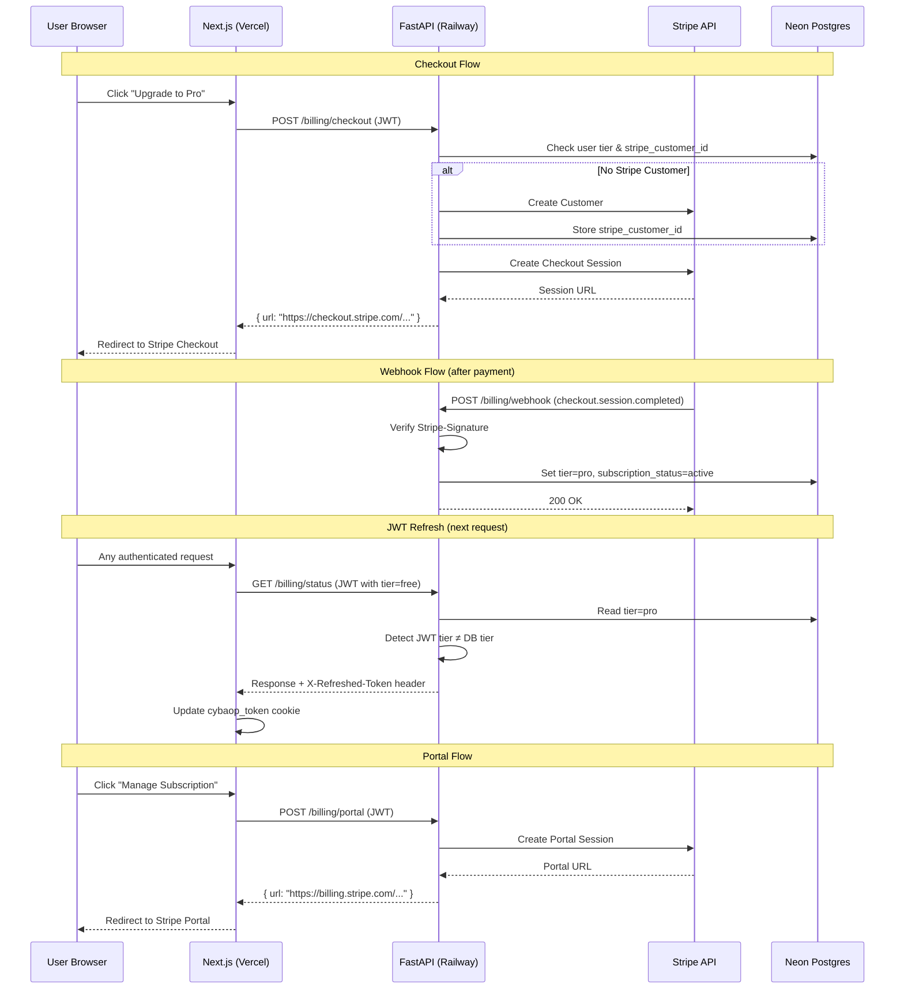
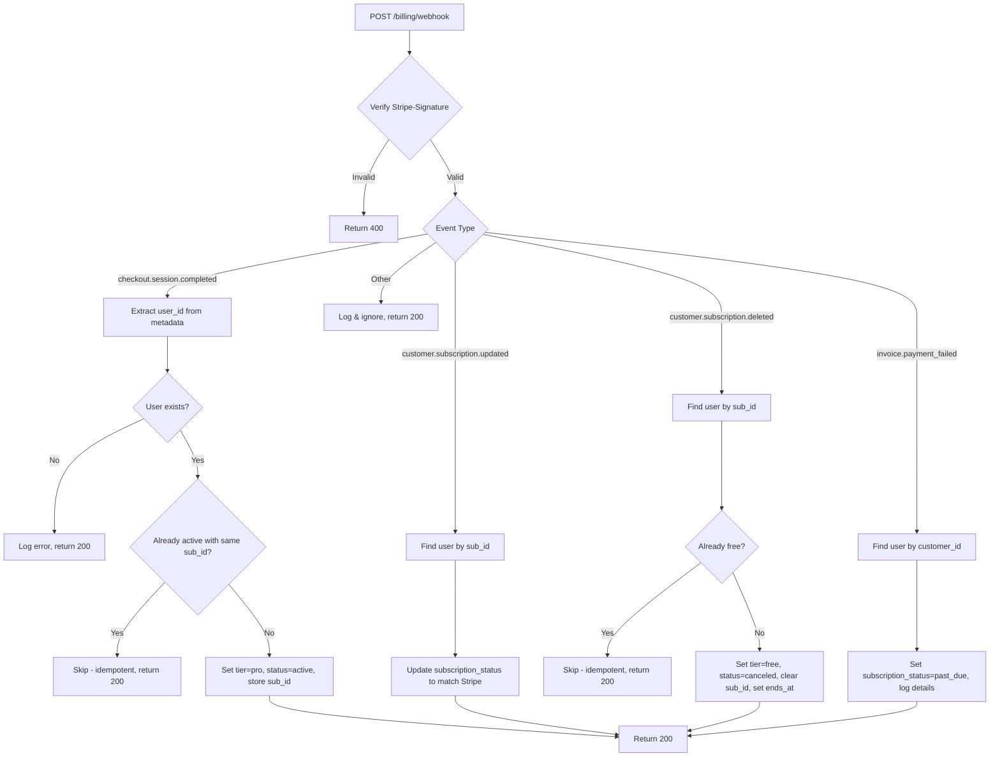
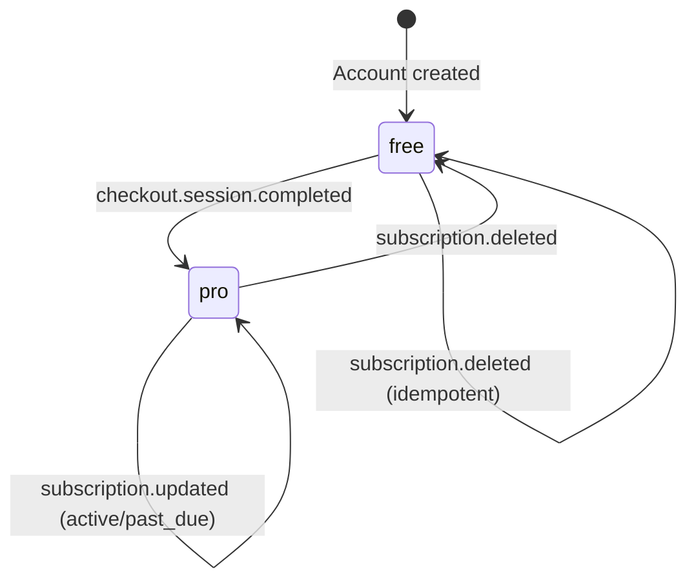

# Design Document: Stripe Billing Integration

## Overview

This design replaces CybaOp's mock billing flow with a real Stripe integration. The current `POST /billing/upgrade` endpoint upgrades users without payment — this gets replaced by Stripe Checkout (hosted payment page) for new subscriptions and Stripe Customer Portal for self-service management. All tier state changes are driven by Stripe webhooks, ensuring users only gain Pro access after verified payment.

The integration touches three layers:
1. **Backend (FastAPI)**: New billing service with checkout session creation, portal session creation, webhook processing with signature verification, and a JWT refresh mechanism for propagating tier changes.
2. **Database (Neon Postgres)**: Four new nullable columns on the `users` table to track Stripe customer/subscription state.
3. **Frontend (Next.js)**: Updated proxy routes for checkout/portal redirects, webhook passthrough, and Pro page UI changes to reflect subscription state.

The `stripe` Python package handles all Stripe API interactions. No custom payment form is needed — Stripe Checkout and Portal are fully hosted.

### Key Design Decisions

| Decision | Rationale |
|---|---|
| Webhook-driven tier changes only | Prevents granting Pro access before payment clears. The checkout endpoint returns a redirect URL, not a tier change. |
| Additive schema migration (ALTER TABLE ADD COLUMN) | All 4 new columns are nullable, so existing rows and the 77 existing tests are unaffected. |
| Stripe Customer created lazily at checkout time | Avoids creating Stripe customers for users who never attempt to upgrade. |
| JWT refresh via `X-Refreshed-Token` response header | Avoids forcing re-login after webhook-driven tier changes. The frontend proxy picks up the header and updates the cookie. |
| `_tier_features()` function preserved as-is | Existing tests depend on its output shape. The billing status endpoint adds new fields alongside the existing ones. |
| Graceful degradation when Stripe env vars are missing | App starts without Stripe functionality (logs warning). Existing non-billing features continue working. |

## Architecture



### Webhook Event Dispatch



### Tier State Machine



Subscription status transitions independently:
- `null` → `active` (checkout completed)
- `active` → `past_due` (payment failed)
- `past_due` → `active` (payment recovered)
- `active` → `canceled` (subscription deleted)
- `past_due` → `canceled` (subscription deleted)

## Components and Interfaces

### 1. Settings Additions (`backend/src/shared/config.py`)

Three new optional fields on the `Settings` class:

```python
# Stripe (optional — app starts without them)
stripe_secret_key: str = ""
stripe_webhook_secret: str = ""
stripe_pro_price_id: str = ""
```

All default to empty string. The billing service checks for non-empty values before attempting Stripe operations.

Frontend env var (in `.env.local` / Vercel):
```
NEXT_PUBLIC_STRIPE_PUBLISHABLE_KEY=pk_live_...
```

This is only used client-side for display purposes (e.g., showing the key is configured). All actual Stripe API calls go through the backend.

### 2. Billing Service (`backend/src/api/routes/billing.py`)

The existing file is refactored. The `_tier_features()` function is preserved unchanged.

#### Endpoints

| Method | Path | Auth | Description |
|---|---|---|---|
| `GET` | `/billing/status` | JWT | Returns tier, is_pro, features, subscription_status, subscription_ends_at, warning |
| `POST` | `/billing/checkout` | JWT | Creates Stripe Checkout Session, returns URL |
| `POST` | `/billing/portal` | JWT | Creates Stripe Portal Session, returns URL |
| `POST` | `/billing/webhook` | None (Stripe signature) | Processes Stripe webhook events |
| `POST` | `/billing/upgrade` | JWT | Returns 410 Gone (deprecated) |

#### Checkout Session Creator

```python
@router.post("/checkout")
async def create_checkout(user: dict = Depends(get_current_user)):
    """Create a Stripe Checkout Session for Pro subscription."""
    # 1. Validate: user not already active
    # 2. Get or create Stripe Customer
    # 3. Create Checkout Session with metadata={user_id}
    # 4. Return {"url": session.url}
```

#### Portal Session Creator

```python
@router.post("/portal")
async def create_portal(user: dict = Depends(get_current_user)):
    """Create a Stripe Customer Portal session."""
    # 1. Validate: user has stripe_customer_id and is pro tier
    # 2. Create Portal Session with return_url
    # 3. Return {"url": session.url}
```

#### Webhook Processor

```python
@router.post("/webhook")
async def stripe_webhook(request: Request):
    """Process Stripe webhook events with signature verification."""
    # 1. Read raw body + Stripe-Signature header
    # 2. Verify with stripe.Webhook.construct_event()
    # 3. Dispatch by event type
    # 4. Always return 200 (even on internal errors, to prevent Stripe retries)
```

### 3. Database Query Functions (`backend/src/db/queries.py`)

New functions added:

```python
async def get_user_by_stripe_customer(customer_id: str) -> dict | None:
    """Find user by stripe_customer_id."""

async def get_user_by_stripe_subscription(subscription_id: str) -> dict | None:
    """Find user by stripe_subscription_id."""

async def update_user_stripe_info(
    user_id: str,
    stripe_customer_id: str | None = ...,
    stripe_subscription_id: str | None = ...,
    subscription_status: str | None = ...,
    subscription_ends_at: datetime | None = ...,
    tier: str | None = ...,
) -> None:
    """Update Stripe-related fields on the user record."""
```

### 4. JWT Refresh Middleware

Rather than a full middleware, this is a utility function called from the billing status endpoint (and optionally other endpoints):

```python
def maybe_refresh_jwt(user_jwt: dict, db_user: dict) -> str | None:
    """If JWT tier differs from DB tier, return a new JWT. Otherwise None."""
    if user_jwt.get("tier") != db_user.get("tier"):
        return create_jwt(db_user["id"], db_user["username"], db_user["tier"])
    return None
```

The billing status endpoint calls this and sets `X-Refreshed-Token` on the response if a new token is generated.

### 5. Frontend Proxy Routes

#### `app/api/billing/checkout/route.ts` (new)

```typescript
// POST handler: proxy to backend /billing/checkout, return JSON with url
```

#### `app/api/billing/portal/route.ts` (new)

```typescript
// POST handler: proxy to backend /billing/portal, return JSON with url
```

#### `app/api/billing/webhook/route.ts` (new)

```typescript
// POST handler: forward raw body + Stripe-Signature header to backend
// No auth cookie needed — Stripe calls this directly
```

#### `app/api/billing/upgrade/route.ts` (modified)

Updated to call `/billing/checkout` instead of `/billing/upgrade`. Returns the checkout URL for the frontend to redirect.

#### `app/api/billing/status/route.ts` (modified)

Updated to check for `X-Refreshed-Token` header in the backend response and update the `cybaop_token` cookie if present.

### 6. Pro Page UI Changes (`app/dashboard/pro/page.tsx`)

The `BillingStatus` interface expands:

```typescript
interface BillingStatus {
  tier: string;
  is_pro: boolean;
  features: Record<string, boolean>;
  subscription_status: string | null;  // new
  subscription_ends_at: string | null; // new
  warning: string | null;              // new
}
```

UI state logic:
- `is_pro && subscription_status === "active"`: Show "Manage Subscription" button + green active badge
- `is_pro && subscription_status === "past_due"`: Show warning banner + "Update Payment" button (links to portal)
- `!is_pro`: Show pricing card + "Upgrade to Pro" button (triggers checkout redirect)
- Loading state on both upgrade and manage buttons during API calls
- Success state after returning from Stripe checkout with `session_id` query param

### 7. Stripe Error Classes (`backend/src/shared/errors.py`)

New error class:

```python
class StripeError(CybaOpError):
    """Stripe API call failed."""
    def __init__(self, message: str):
        super().__init__(message, "STRIPE_ERROR")
```

Added to `STATUS_MAP` in error handler: `"STRIPE_ERROR": 502`.


## Data Models

### Database Schema Changes

Four new nullable columns added to the `users` table via `ALTER TABLE`. These are also added to the `CREATE TABLE IF NOT EXISTS` in `schema.py` for fresh installs.

```sql
-- Migration (run once against Neon Postgres)
ALTER TABLE users ADD COLUMN IF NOT EXISTS stripe_customer_id TEXT;
ALTER TABLE users ADD COLUMN IF NOT EXISTS stripe_subscription_id TEXT;
ALTER TABLE users ADD COLUMN IF NOT EXISTS subscription_status TEXT;
ALTER TABLE users ADD COLUMN IF NOT EXISTS subscription_ends_at TIMESTAMPTZ;

-- Index for webhook lookups by Stripe customer ID
CREATE INDEX IF NOT EXISTS idx_users_stripe_customer
    ON users(stripe_customer_id) WHERE stripe_customer_id IS NOT NULL;

-- Index for webhook lookups by Stripe subscription ID
CREATE INDEX IF NOT EXISTS idx_users_stripe_subscription
    ON users(stripe_subscription_id) WHERE stripe_subscription_id IS NOT NULL;
```

Updated `CREATE TABLE` in `schema.py`:

```sql
CREATE TABLE IF NOT EXISTS users (
    id TEXT PRIMARY KEY,
    soundcloud_user_id TEXT UNIQUE NOT NULL,
    username TEXT NOT NULL,
    display_name TEXT NOT NULL DEFAULT '',
    soundcloud_token TEXT NOT NULL,
    tier TEXT NOT NULL DEFAULT 'free',
    avatar_url TEXT NOT NULL DEFAULT '',
    created_at TIMESTAMPTZ NOT NULL DEFAULT NOW(),
    last_analytics_at TIMESTAMPTZ,
    updated_at TIMESTAMPTZ NOT NULL DEFAULT NOW(),
    -- Stripe billing fields (all nullable for backward compat)
    stripe_customer_id TEXT,
    stripe_subscription_id TEXT,
    subscription_status TEXT,
    subscription_ends_at TIMESTAMPTZ
);
```

### Pydantic Response Models

```python
class BillingStatusResponse(BaseModel):
    """GET /billing/status response."""
    tier: str
    is_pro: bool
    features: dict[str, bool]
    subscription_status: str | None = None
    subscription_ends_at: str | None = None  # ISO 8601
    warning: str | None = None

class CheckoutResponse(BaseModel):
    """POST /billing/checkout response."""
    url: str

class PortalResponse(BaseModel):
    """POST /billing/portal response."""
    url: str
```

### Stripe Checkout Session Metadata

```json
{
  "user_id": "<cybaop-user-uuid>"
}
```

This is set when creating the Checkout Session and read back in the `checkout.session.completed` webhook event.

### Subscription Status Values

| Value | Meaning | Tier |
|---|---|---|
| `null` | Never subscribed | `free` |
| `active` | Subscription current and paid | `pro` |
| `past_due` | Payment failed, grace period | `pro` (with warning) |
| `canceled` | Subscription ended | `free` |
| `trialing` | Trial period (future use) | `pro` |

### Webhook Event → Action Mapping

| Stripe Event | Lookup Key | DB Changes |
|---|---|---|
| `checkout.session.completed` | `metadata.user_id` | `tier=pro`, `subscription_status=active`, store `stripe_subscription_id` |
| `customer.subscription.updated` | `stripe_subscription_id` | Update `subscription_status` to match Stripe |
| `customer.subscription.deleted` | `stripe_subscription_id` | `tier=free`, `subscription_status=canceled`, clear `stripe_subscription_id`, set `subscription_ends_at` |
| `invoice.payment_failed` | `stripe_customer_id` | `subscription_status=past_due` |


## Correctness Properties

*A property is a characteristic or behavior that should hold true across all valid executions of a system — essentially, a formal statement about what the system should do. Properties serve as the bridge between human-readable specifications and machine-verifiable correctness guarantees.*

### Property 1: Stripe field storage round-trip

*For any* valid combination of `stripe_customer_id` (arbitrary non-empty string), `stripe_subscription_id` (arbitrary non-empty string), `subscription_status` (one of `active`, `past_due`, `canceled`, `trialing`), and `subscription_ends_at` (arbitrary datetime), storing these values on a user record and reading them back should produce identical values.

**Validates: Requirements 1.1, 1.2, 1.3, 1.4**

### Property 2: Webhook signature verification gate

*For any* raw request body and Stripe-Signature header, if `stripe.Webhook.construct_event` raises `SignatureVerificationError`, the webhook endpoint should return HTTP 400. If verification succeeds, the endpoint should return HTTP 200 and process the event.

**Validates: Requirements 5.2, 5.3**

### Property 3: Checkout session creation correctness

*For any* free-tier user (with `subscription_status` not `active`), creating a checkout session should produce a response containing a `url` field, and the Stripe API should be called with: `mode=subscription`, the correct `price_id`, `metadata` containing the user's `user_id`, a `success_url` pointing to the Pro page, and a `cancel_url` pointing to the Pro page.

**Validates: Requirements 3.1, 3.4, 3.5, 3.6, 3.7**

### Property 4: Checkout rejects already-active subscribers

*For any* user with `subscription_status` of `active`, calling `POST /billing/checkout` should return HTTP 400 and not create a Stripe Checkout Session.

**Validates: Requirements 3.8**

### Property 5: Stripe Customer creation vs reuse

*For any* user, if `stripe_customer_id` is NULL at checkout time, a new Stripe Customer should be created and stored on the user record. If `stripe_customer_id` is already set, no new customer should be created and the existing ID should be passed to the Checkout Session.

**Validates: Requirements 3.2, 3.3**

### Property 6: checkout.session.completed upgrades user

*For any* `checkout.session.completed` webhook event with valid signature and a `user_id` in metadata matching an existing user, after processing: the user's `tier` should be `pro`, `subscription_status` should be `active`, and `stripe_subscription_id` should match the subscription ID from the event.

**Validates: Requirements 6.2, 6.3**

### Property 7: customer.subscription.updated syncs status

*For any* `customer.subscription.updated` webhook event with valid signature, the user's `subscription_status` should be updated to match the Stripe subscription's status. When the status is `past_due`, the user's `tier` should remain `pro`. When the status is `active`, the user's `tier` should remain `pro`.

**Validates: Requirements 7.1, 7.2, 7.3**

### Property 8: customer.subscription.deleted downgrades user

*For any* `customer.subscription.deleted` webhook event with valid signature matching an existing user, after processing: the user's `tier` should be `free`, `subscription_status` should be `canceled`, `stripe_subscription_id` should be NULL, and `subscription_ends_at` should equal the subscription's `current_period_end`.

**Validates: Requirements 8.1, 8.2, 8.3**

### Property 9: invoice.payment_failed sets past_due

*For any* `invoice.payment_failed` webhook event with valid signature, the user identified by the Stripe Customer ID should have `subscription_status` set to `past_due`.

**Validates: Requirements 9.1**

### Property 10: Checkout idempotency

*For any* user who already has `subscription_status` of `active` and a `stripe_subscription_id` matching the event's subscription ID, processing a `checkout.session.completed` event should be a no-op — the user record should remain unchanged and the endpoint should return HTTP 200.

**Validates: Requirements 15.1**

### Property 11: Deletion idempotency

*For any* user who already has `tier` of `free`, processing a `customer.subscription.deleted` event should be a no-op — the user record should remain unchanged and the endpoint should return HTTP 200.

**Validates: Requirements 15.2**

### Property 12: JWT refresh on tier mismatch

*For any* authenticated request where the JWT `tier` claim differs from the user's `tier` in the database, the response should include an `X-Refreshed-Token` header containing a valid JWT with the database tier. When the JWT tier matches the database tier, no `X-Refreshed-Token` header should be present.

**Validates: Requirements 6.4, 14.2**

### Property 13: Billing status reflects database state

*For any* user, the `GET /billing/status` response should: set `is_pro` based on the database `tier` (not the JWT claim), include `subscription_status` from the database, include `subscription_ends_at` from the database, and include a `warning` field with "Your payment method needs updating" if and only if `subscription_status` is `past_due`. The response must always include `tier`, `is_pro`, and `features` fields for backward compatibility.

**Validates: Requirements 12.1, 12.2, 12.3, 12.4, 16.1**

### Property 14: Portal session creation for Pro users

*For any* Pro-tier user with a non-null `stripe_customer_id`, creating a portal session should produce a response containing a `url` field, and the Stripe API should be called with the user's `stripe_customer_id` and a `return_url` pointing to the Pro page.

**Validates: Requirements 10.1, 10.2, 10.3**

### Property 15: _tier_features backward compatibility

*For any* tier value in `{free, pro, enterprise}`, `_tier_features(tier)` should return a dict where all keys from the `free` tier are present, and the values for Pro-only features are `True` when tier is `pro` or `enterprise` and `False` when tier is `free`.

**Validates: Requirements 16.3**


## Error Handling

### Stripe API Failures

| Scenario | HTTP Status | Error Code | User-Facing Message |
|---|---|---|---|
| Stripe Checkout Session creation fails | 502 | `STRIPE_ERROR` | "Payment service temporarily unavailable. Please try again." |
| Stripe Portal Session creation fails | 502 | `STRIPE_ERROR` | "Subscription management temporarily unavailable." |
| Stripe Customer creation fails | 502 | `STRIPE_ERROR` | "Payment service temporarily unavailable. Please try again." |
| Stripe env vars missing (checkout/portal called) | 503 | `STRIPE_ERROR` | "Billing is not configured. Contact support." |

All Stripe API errors are caught, logged with structlog (including the Stripe error code and message), and wrapped in a `StripeError` exception that maps to HTTP 502 via the existing error handler.

### Webhook Error Handling

Webhooks follow a "never fail" pattern — Stripe retries on non-2xx responses, so we return 200 even when internal processing fails (after logging the error). The only exceptions that return non-200:

| Scenario | HTTP Status | Reason |
|---|---|---|
| Missing `Stripe-Signature` header | 400 | Not a valid Stripe request |
| Signature verification fails | 400 | Tampered or replayed request |

For all other errors during webhook processing (DB errors, missing users, etc.):
- Log the error at `error` level with full context (event type, event ID, user ID if available)
- Return HTTP 200 to prevent Stripe retries
- The webhook is designed to be retried safely due to idempotency (Properties 10, 11)

### Checkout Guard Errors

| Scenario | HTTP Status | Error Code | Message |
|---|---|---|---|
| User already has active subscription | 400 | `VALIDATION_ERROR` | "You already have an active Pro subscription." |
| User not authenticated | 401 | — | "Missing or invalid Authorization header" |

### Portal Guard Errors

| Scenario | HTTP Status | Error Code | Message |
|---|---|---|---|
| User has no `stripe_customer_id` | 400 | `VALIDATION_ERROR` | "No subscription found. Use checkout to subscribe." |
| User is not Pro tier | 403 | `TIER_RESTRICTION` | "Portal access requires an active Pro subscription." |
| User not authenticated | 401 | — | "Missing or invalid Authorization header" |

### Database Errors

Database failures during billing operations (e.g., storing `stripe_customer_id` after customer creation) are caught and:
- Logged at `error` level
- In webhook context: return 200 (Stripe will retry, and idempotency handles re-processing)
- In checkout/portal context: raise `DatabaseError` which maps to HTTP 503

### Frontend Error Handling

The Next.js proxy routes handle backend errors:
- 4xx from backend → forward status and message to browser
- 5xx from backend → return 502 with generic "service unavailable" message
- Network timeout → return 502 (handled by `lib/fetch.ts` retry logic)
- `X-Refreshed-Token` processing failure → silently ignore (user can still use the app, token refreshes on next request)

## Testing Strategy

### Property-Based Testing

Property-based tests use the `hypothesis` library (Python) with a minimum of 100 examples per property. Each test is tagged with a comment referencing the design property.

```
pip install hypothesis
```

Add to `pyproject.toml` dev dependencies:
```toml
[project.optional-dependencies]
dev = [
    # ... existing deps ...
    "hypothesis>=6.100.0",
]
```

Each property test follows this pattern:

```python
from hypothesis import given, strategies as st, settings

# Feature: stripe-billing, Property 1: Stripe field storage round-trip
@settings(max_examples=100)
@given(
    customer_id=st.text(min_size=1, max_size=50),
    subscription_id=st.text(min_size=1, max_size=50),
    status=st.sampled_from(["active", "past_due", "canceled", "trialing"]),
)
def test_stripe_field_round_trip(customer_id, subscription_id, status):
    ...
```

Property tests are placed in `backend/tests/unit/test_billing_properties.py`.

### Unit Tests

Unit tests cover specific examples, edge cases, and integration points. Placed in `backend/tests/unit/test_billing.py`.

Key unit test cases:
- `_tier_features("free")` returns expected keys with Pro features as `False`
- `_tier_features("pro")` returns expected keys with Pro features as `True`
- Checkout with missing Stripe config returns 503
- Portal with no `stripe_customer_id` returns 400
- Portal with free tier returns 403
- Webhook with missing `Stripe-Signature` header returns 400
- Webhook with unknown event type returns 200 (ignored)
- Webhook with non-existent `user_id` in metadata returns 200
- `POST /billing/upgrade` returns 410 Gone
- Billing status response includes all required fields (tier, is_pro, features, subscription_status, subscription_ends_at)
- `maybe_refresh_jwt` returns None when tiers match
- `maybe_refresh_jwt` returns new JWT when tiers differ

### Test Isolation

- All Stripe API calls are mocked (no real Stripe calls in tests)
- Database calls are mocked using the existing test patterns (no real DB in unit tests)
- The `stripe` module is patched at the module level in test fixtures
- Existing 77 tests must continue passing — verified by running the full suite after changes

### Dual Testing Approach

- **Unit tests**: Verify specific examples (410 on old upgrade endpoint, 400 on missing signature), edge cases (unknown user in webhook, missing Stripe config), and error conditions (Stripe API failures)
- **Property tests**: Verify universal properties across all inputs (idempotency, round-trip storage, signature verification gate, tier state transitions, JWT refresh correctness)
- Together they provide comprehensive coverage — unit tests catch concrete bugs, property tests verify general correctness across the input space

### Test Execution

```bash
# Run all tests including new billing tests
PYTHONPATH=backend python3.11 -m pytest backend/tests/unit/ -x -q

# Run only billing property tests
PYTHONPATH=backend python3.11 -m pytest backend/tests/unit/test_billing_properties.py -x -v

# Run only billing unit tests
PYTHONPATH=backend python3.11 -m pytest backend/tests/unit/test_billing.py -x -v
```
